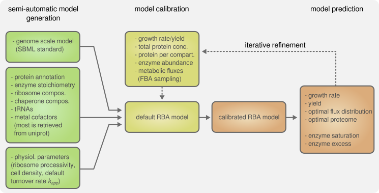

*Ralstonia eutropha H16* RBA model
================
Michael Jahn,
2020-04-28

***

## Overview

This resource balance analysis (RBA) model was generated using the [RBApy package from Bulovic et al.](https://doi.org/10.1016/j.ymben.2019.06.001), using a genomse scale metabolic model (GSM) originally developed by [Park et al., 2011](http://bmcsystbiol.biomedcentral.com/articles/10.1186/1752-0509-5-101). The original genome scale model was refactored and many reactions were curated and harmonized to community standards as e.g. available through the [Bigg model database](bigg.ucsd.edu/). The genome scale model that serves as base for the RBA model is maintained on [github.com/m-jahn/](https://github.com/m-jahn/genome-scale-models).

The RBA model is an extension of the GSM where the solution space is constrained by many additional parameters. Model construction and parameter estimation are described below in more detail. Parameter estimation was largely based on the following publications:

 - [Bulovic et al., 2019](https://doi.org/10.1016/j.ymben.2019.06.001): automatic model creation workflow.
 - [Goelzer at al., 2015](https://doi.org/10.1016/j.ymben.2015.10.003): set of parameters for transcription, translation, and other fundamental cellular functions.
 - [Park et al., 2011](http://bmcsystbiol.biomedcentral.com/articles/10.1186/1752-0509-5-101): cell composition of *R. eutropha* (original biomass equation), basis for GSM.

<p align="center">
  
</p>

----------

## Generation of the XML model

The *Ralstonia eutropha H16* RBA model was generated in a step-wise manner,
based on information from a hand-curated GSM. 


### Step 1: Generation of a default model

For initial creation of the RBA model, the following input files were used. The fasta file headers have to be formatted according to this pattern: `rba|id|name|set_name|stoichiometry`.

 - `data/sbml.xml`: metabolic netwok from the hand-curated model. Some minor modifications were made to make it fit before RBA model construction (see `generate_model.py`). For example, empty gene associations were replaced with `UNKNOWN` to prevent RBA reading those reactions as spontaneous.
 - `data/ribosome.fasta`: composition of ribosome (rRNA and proteins). rRNA sequences were retrieved from NCBI, ribosomal protein sequence and subunit structure from uniprot. 68 ribosomal proteins were included. Ribosomal stoichiometry was assumed to be one subunit each for 30S and 50S subunits, except for L7/L12 that forms 2-4 dimers per ribosome (`n >= 4`). *TODO: update stochiometry for elongation and initiation factors.*
 - `data/chaperones.fasta`: composition of molecular machines involved in protein folding. These include the protein subunits `groES`, `groEL`, `dnaJ`, `dnaK`, `grpE`, `trigger factor tig`, `htpG`, and `hfq` with their respective number od subunits obtained from uniprot.
 - `data/trnas.fasta`: composition of tRNAs. tRNA sequences were retrieved from NCBI, and only one representative tRNA (the first) per amino acid was used (20 out of 61 tRNAs).
 - `params.in`: pipeline parameters.

The initial RBApy model generation was performed via the following customized function. The function automatically applies custom changes to the SBML model, imports the `params.in` file with basic settings, and generates the model files.

```
python3 generate_model.py
```

### Step 2: Generation of a model improved through helper files

This first run downloaded `data/uniprot.csv`, generated helper files `data/*.tsv`, and generated a first XML model. The following modifications were then made to helper files.

 - `location_map.tsv`: the uniprot compartment names were mapped to generic names (such as `Cytoplasm`)
 - `metabolites.tsv`: this table contains target metabolite concentrations for basic biomolecules and cofactors (for example `ATP`, `dATP`, `thiamin`, and so on). Molecules that are already contained in macrocomponents were set to zero. One exception are some nucleotide species that are present in more detail compared to macrocomponent reactions.
 - `macrocomponents.tsv`: This table was supplemented with all major cell components (such as lipopolysaccharides, peptidoglycan, cofactors, and so on) and corresponding target concentrations from the original model's biomass equation. Target fluxes to other metabolites can be defined here as well, such as flux to PHB.
 - `medium.tsv`: added new minimal medium.
 - `subunits.tsv`: updated some protein stoichiometries (ATP synthase).
 - `unknown_proteins.tsv`: (empty) the SBML model contains no genes that could not be mapped

Two additional macroprocesses were added, **transcription of DNA to mRNA**, and **DNA replication**. 
The RBApy source code was adapted to automatically load protein associations from `transcription.fasta` and `replication.fasta` (see [github fork extra processes](https://github.com/m-jahn/RBApy/tree/extra_processes)). 

#### Machinery for transcription (TSC)

 - We need **a capacity constraint**, effectively the transcription rate per RNA polymerase unit that is added to parameters. On bionumbers, several values in the range of 20-80 nt per second per unit RNA polymerase are given. We take the most recent estimate for *E. coli*, 62 nt/s or 223200 nt/h (source: Epshtein V, Nudler E. Cooperation between RNA polymerase molecules in transcription elongation. Science. 2003 May 2 300(5620):801-5.). PubMed ID12730602.
- We need **proteins that catalyze transcription** (RNA polymerase complex). The canonical RNA polymerase in bacteria consists of 2 alpha, 1 beta, 1 beta prime, and 1 omega subunit. When a sigma factor is associated with the core, the holoenzyme is formed, which can initiate transcription. Four proteins were added as important sigma factors, rpoD1, D2, rpoS, and rpoN, each with partial contribution of 0.25 (source: uniprot.org, subunit structure).

#### Machinery for replication (REP)

- DNA replication is mainly catalyzed by DNA-dependent DNA polymerase III. We need to add a rate for this enzyme. Bionumbers gives estimates from 600-1000 nt/s, so on average 800 nt/s or 2880000 nt/h.
- DNA polymerase III contains a core (composed of alpha, epsilon and theta chains) that associates with a tau subunit. This core dimerizes to form the POLIII complex. PolIII associates with the gamma complex (composed of gamma, delta, delta prime, psi and chi chains) and with the beta chain to form the complete DNA polymerase III complex.
Additionally DNA helicase (hexamer), DNA (primase monomer), and DNA beta clamp (dimer) was added. The theta subunit (holE) is missing (`'Q0KD75': 2, 'Q0K8W5': 2, 'Q0K937': 3, 'Q0K709': 1, 'Q0KBB9': 1, 'Q0K7F6': 1, 'Q0K9E9': 6, 'Q0K866': 1, 'Q0KFR7': 2`). Source: uniprot.org, subunit structure.

### Step 3: Generate and solve full model

In the last step, the full model can be generated by running one more iteration of:
```
python3 generate_model.py
```

The model can then be solved by running:

```
python3 solve_rba_model.py .
```

### Step 4: Calibration

The model can be calibrated with proteomics data, fluxomics data, or other estimations of the `k_app` parameter. `k_app` is a collective term that links enzyme abundance to enzyme rate/flux (termed 'enzyme efficiency' in RBA). It's theoretical maximum is `k_cat`, the maximum turnover rate of an enzyme, but it also depends on the metabolite concentration (therefore saturation).

#### k_app

`k_app` was estimated following the procedure and scripts from the original `RBApy` publication and the accompanying [github repository](https://github.com/SysBioInra/RBApy). The main script for `k_app` estimation is `kapp.py`, that was slightly customized for this model. The input are flux boundaries obtained from flux sampling analysis (FSA), enzyme abundance in mmol gDCW<sub>-1</sub>, and the GSM/RBA models. It performs `k_app` estimation by dividing apparent flux by enzyme abundance. The input parameters and final results for `k_app` estimation are detailed in the R notebook [Ralstonia model constraints](https://m-jahn.github.io/R-notebooks/Ralstonia_model_constraints.nb.html).

Alternatively, `k_app` values e.g. obtained from BRENDA can optionally be included using the following command in `generate_model.py`:    `reutropha.set_enzyme_efficiencies('data/enzyme_efficiency.tsv')`

#### Total protein pool

The total protein pool (or concentration _c_) in mmol per gram dry cell weight (gDCW) was estimated based on the publication by Park et al, 2011. They reported an estimated protein concentration for _R. eutropha_ of 0.68 g/gDCW. For comparison, cyanobacteria's protein concentration was estimated with 0.65 g/gDCW. Assuming an average molecular weight per amino acid of 110 g/mol, total protein mass is calculated as:

`c = 0.68 g/gDCW / 110 g/mol * 1000 = 6.1818 mmol/gDCW`

#### Protein fraction per compartment

Protein fraction per compartment was calculated as described in the R notebook [Ralstonia model constraints](https://m-jahn.github.io/R-notebooks/Ralstonia_model_constraints.nb.html). Using proteomics data with annotated protein localization as input, the following growth rate dependent linear models were obtained.

- Fraction of cytoplasmic proteins: `0.8684 + 0.1060 * µ`
- Fraction cytoplasmic membrane proteins: `0.1316 - 0.1060 * µ`

#### Non-enzymatic protein fraction per compartment

Similarly to the above estimation, the non-enzymatic (NE) protein fraction per compartment was determined from proteomics data annotated with gene-reaction associations from the RBA model [Ralstonia model constraints](https://m-jahn.github.io/R-notebooks/Ralstonia_model_constraints.nb.html). 

- Fraction of NE proteins in cytoplasm: `0.5374 - 0.5657 * µ`
- Fraction of NE proteins in cytoplasmic membrane: `0.8414 - 0.2147 * µ`
